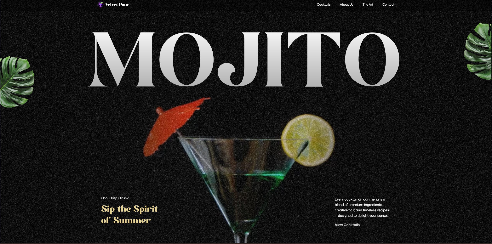

<div align="center">
  <br />
    <a href="https://cocktails-menu-gsap.vercel.app" target="_blank">
      
    </a>
  <br />

   <div>
    
    
    
  </div>

  <h3 align="center">Cocktail Website using GSAP animations</h3>

</div>

## 📋 <a name="table">Table of Contents</a>

1. 🤖 [Introduction](#introduction)
2. ⚙️ [Tech Stack](#tech-stack)
3. 🔋 [Features](#features)
4. 🤸 [Quick Start](#quick-start)


## <a name="introduction">🤖 Introduction</a>

In this project, i learned how to build a GSAP-powered cocktail website using React and Tailwind CSS—a modern, scroll-driven experience packed with advanced animations. Bringing design to life with dynamic SplitText reveals, smooth parallax scrolling, and scroll-triggered effects using GSAP’s ScrollTrigger. Lock sections in place with pinned animations, sync video playback to scroll position for cinematic storytelling, and enhance visual impact with scroll-based image masking. Create a custom animated carousel, craft seamless timeline animations across sections, and ensure a fully responsive UI that adapts beautifully across all screen sizes.


## <a name="tech-stack">⚙️ Tech Stack</a>


- **[GSAP](https://gsap.com/)** is a powerful JavaScript animation library used in this project to create dynamic, scroll-driven visuals. Features include SplitText animations for bold text reveals, ScrollTrigger for timeline control, parallax scrolling, pinned sections, scroll-synced video playback, seamless multi-section timelines, image masking effects, and a fully custom animated carousel.

- **[React](https://react.dev/)** is a declarative JavaScript library for building interactive UIs. It provides the component structure for modular development, allowing smooth integration of GSAP animations, reusable logic for scroll behavior, and support for responsive layout and state-driven UI features like carousels and video sections.

- **[Tailwind CSS](https://tailwindcss.com/)** is a utility-first CSS framework that allows developers to design custom user interfaces by applying low-level utility classes directly in HTML, streamlining the design process.

- **[Vite](https://vitejs.dev/)** is a lightning-fast build tool and development server that powers this project’s workflow. It enables instant hot module replacement, fast startup, and optimized production builds—ideal for an animation-heavy React site with smooth, real-time development feedback and minimal config.

## <a name="features">🔋 Features</a>

👉 **SplitText Animations**: Create impactful text reveals using GSAP’s SplitText for dynamic intros and section highlights.

👉 **ScrollTrigger Effects**: Power scroll-based animations and timeline control with GSAP’s ScrollTrigger.

👉 **Parallax Scrolling**: Add immersive depth with smooth parallax effects that respond to user scroll.

👉 **Pinned Sections**: Lock sections in view while animating content for engaging scroll experiences.

👉 **Scroll-Synced Video Playback**: Sync video progress with scroll position for cinematic storytelling.

👉 **Image Masking Effects**: Use scroll-triggered pins and masks for visually striking image transitions.

👉 **Custom Carousel**: Build a fully customized carousel with multiple navigation options and animated slides.

👉 **Seamless Timeline Animations**: Craft smooth animation timelines that span across multiple sections.

👉 **Responsive Design**: Ensure fluid UI and adaptive GSAP animations across all screen sizes.

And many more, including enhanced security and optimized video performance!


## <a name="quick-start">🤸 Quick Start</a>


**Installation**

Install the project dependencies using npm:

```bash
npm install
```

**Running the Project**

```bash
npm run dev
```
